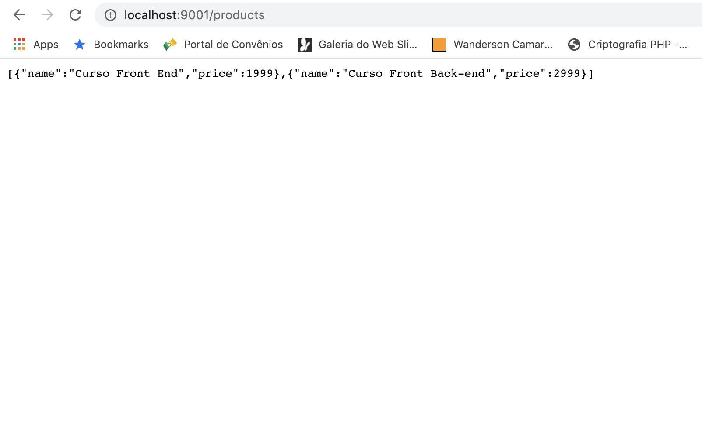
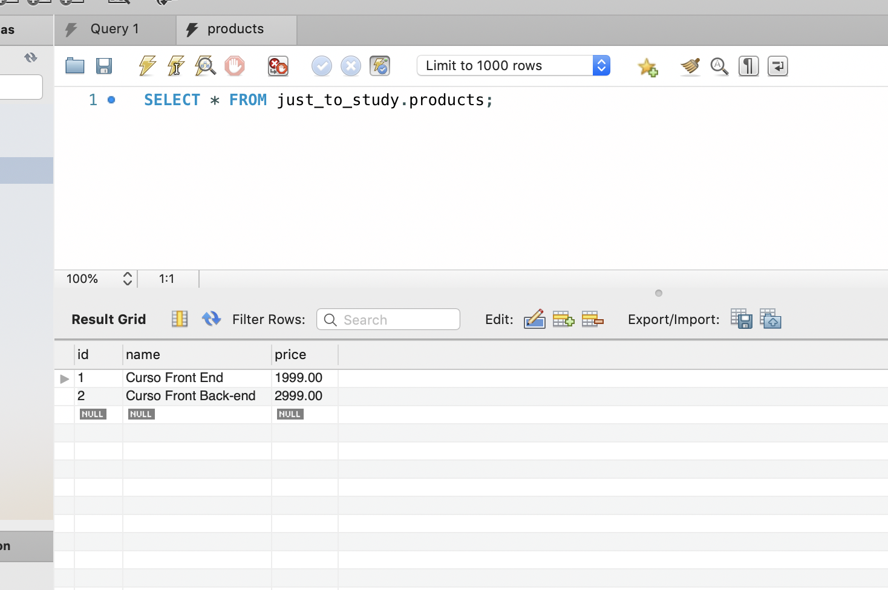
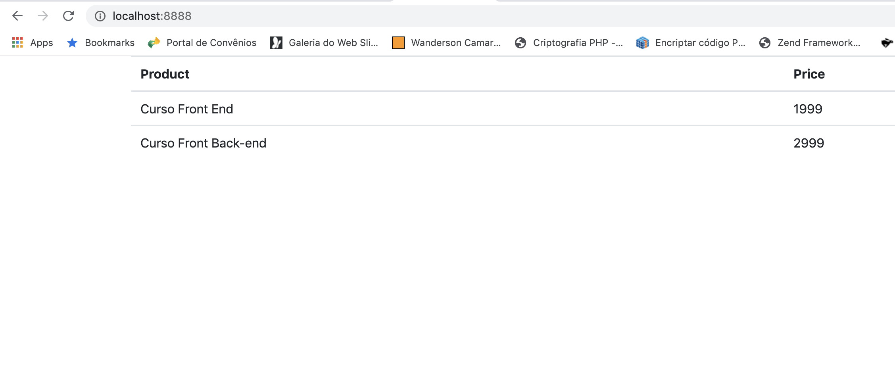

# docker-php-mysql-node-three-containers
Setup docker php + mysql + nodejs with each in its container and talking to each other.<br />
The goal here is not about programming, but a project worked with 3 containers talking to each other, simulating a real environment.

Folder Structure
============================
    .
    ├── api                     # Contain two projects, nodejs and database
    │   ├── db                  # Settings of Database image, scripts and data folder
    │   └── src                 # Project in NodeJS
    ├── website                 # Project in PHP to read the data from node
    └── README.md


### To make this project work it is very simple, install the docker, node packages inside api folder and follow the commands below.
# All comands need to be executed in Root folder

### MySQL

> To create mysql image
```
$ docker build -t mysql-image -f api/db/Dockerfile .
```

> To create a container saving the database data
```
$ docker run -p 3306:3306 -d -v $(pwd)/api/db/data:/var/lib/mysql --rm --name mysql-container mysql-image
```

> To run the content of script.sql inside the mysql-container, this script create the database, table and insert any data
```
$ docker exec -i mysql-container mysql -uroot -pjonathan123 < api/db/script.sql
``` 

### NodeJS

> To create a nodejs image
```
$ docker build -t node-image -f api/Dockerfile .
```

> To create a container
```
$ docker run -d -v $(pwd)/api:/home/node/app -p 9001:9001 --link mysql-container --rm --name node-container node-image
```

### PHP

> To create a php image
```
$ docker build -t php-image -f website/Dockerfile .
```

> To create a container
```
$ docker run -d -v $(pwd)/website:/var/www/html -p 8888:80 --link node-container --rm --name php-container php-image
```

### General docker commands

> To show images available
```
$ docker image ls
```

> To show the running containers
```
$ docker ps
```
> To run bash inside container, in this case, mysql-container
```
$ docker exec -it mysql-container /bin/bash
```

> To stop a specic container
```
$ docker stop mysql-container
```

> To get informations about the container, in this case the IP
```
$ docker inspect mysql-container | grep IPAddress
```

> NodeJS Api


> MySQL


> PHP



